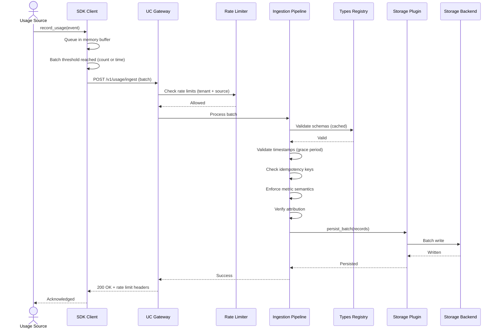
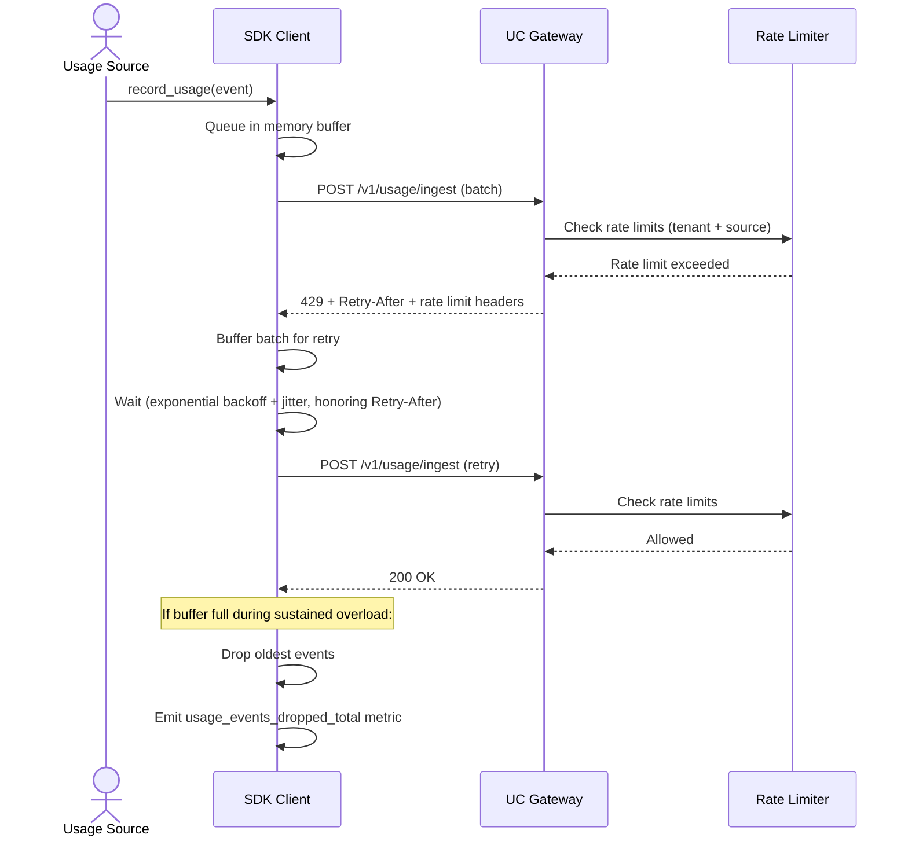
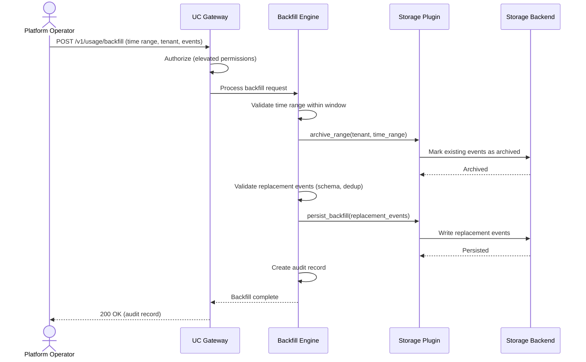
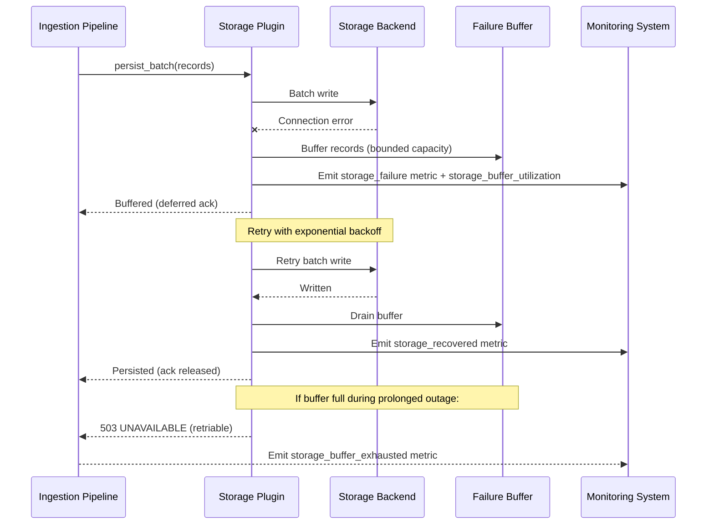

# Technical Design — Usage Collector

## 1. Architecture Overview

### 1.1 Architectural Vision

The Usage Collector follows a **plugin-based gateway pattern** aligned with CyberFabric's modkit architecture. The gateway module orchestrates the write path — ingestion, validation, deduplication, and routing — while delegating persistence to pluggable storage backend plugins (ClickHouse, TimescaleDB, custom). Each plugin implements the full write-path interface for its backend: record persistence, deduplication storage, retention enforcement, and failure buffering.

The architecture strictly separates concerns: UC owns the write path and data integrity; the usage-query module owns the read path and server-side aggregation; business logic (pricing, rating, billing, quota enforcement) remains the responsibility of downstream consumers. This separation ensures the write path can be optimized independently for throughput and latency without read-path coupling.

A client-side SDK provides the primary ingestion path with non-blocking, batched emission for high-throughput sources (10,000+ events/sec). The SDK absorbs transient failures via in-memory buffering with exponential backoff. Server-side, hierarchical rate limiting (per-tenant, per-source) and priority-based load shedding protect the system under sustained overload, preferentially accepting billing-critical events while shedding lower-priority analytics metrics.

### 1.2 Architecture Drivers

#### Functional Drivers

| Requirement | Design Response |
|-------------|-----------------|
| `cpt-cf-usage-collector-fr-usage-ingestion` | Multi-transport ingestion (Rust API, gRPC, HTTP) with SDK-side batching for high-throughput sources |
| `cpt-cf-usage-collector-fr-idempotency` | Idempotency key store with TTL-based cleanup; deduplication check before persistence |
| `cpt-cf-usage-collector-fr-persistence-guarantees` | Post-ack durability via storage plugin confirm-before-ack; pre-ack loss acceptable and observable via SDK metrics |
| `cpt-cf-usage-collector-fr-counter-semantics` | Metric semantics validation in ingestion pipeline; sources submit non-negative deltas; UC accumulates into a persistent monotonically increasing total per (tenant, resource, usage_type) |
| `cpt-cf-usage-collector-fr-gauge-semantics` | Gauge values stored as-is without monotonicity validation |
| `cpt-cf-usage-collector-fr-record-metadata` | Opaque JSON metadata persisted per-record with configurable size limit enforcement |
| `cpt-cf-usage-collector-fr-tenant-attribution` | Tenant ID derived from SecurityContext; immutable attribution on all records |
| `cpt-cf-usage-collector-fr-resource-attribution` | Resource ID, type, and lineage attached to each usage record |
| `cpt-cf-usage-collector-fr-subject-attribution` | Subject ID and type always derived from SecurityContext; payload-supplied subject identity is rejected |
| `cpt-cf-usage-collector-fr-tenant-isolation` | Tenant-scoped storage and fail-closed authorization at all layers |
| `cpt-cf-usage-collector-fr-ingestion-authorization` | Source identity from SecurityContext; usage type and scope authorization enforced per request |
| `cpt-cf-usage-collector-fr-pluggable-storage` | Storage Plugin trait with gateway pattern discovery via Types Registry |
| `cpt-cf-usage-collector-fr-retention-policies` | Configurable retention (global, per-tenant, per-type) with automated enforcement isolated from ingestion |
| `cpt-cf-usage-collector-fr-storage-health` | Storage health monitoring with buffering during failures and retry with backoff |
| `cpt-cf-usage-collector-fr-late-events` | Grace period validation in ingestion pipeline; events within configurable window (default 24h) accepted via normal path |
| `cpt-cf-usage-collector-fr-type-validation` | All records validated against registered type schemas via Types Registry |
| `cpt-cf-usage-collector-fr-custom-units` | Custom measuring unit registration via API without code changes |
| `cpt-cf-usage-collector-fr-tenant-rate-limit` | Per-tenant rate limiting with configurable sustained rate and burst size |
| `cpt-cf-usage-collector-fr-source-rate-limit` | Per-source rate limiting within each tenant keyed by SecurityContext identity |
| `cpt-cf-usage-collector-fr-multi-dimensional-limits` | Multi-dimensional enforcement: events/sec, bytes/sec, batch size, record size — all must pass |
| `cpt-cf-usage-collector-fr-rate-limit-config` | System-wide defaults with per-tenant hot-reloadable overrides; unspecified fields inherit defaults |
| `cpt-cf-usage-collector-fr-rate-limit-response` | Rate limit metadata on all responses; HTTP 429 with Retry-After; gRPC metadata; SDK error structures |
| `cpt-cf-usage-collector-fr-sdk-retry` | SDK bounded in-memory queue; exponential backoff with jitter; loss metrics and alerting on sustained drops |
| `cpt-cf-usage-collector-fr-rate-limit-observability` | Per-tenant/per-source rate limit consumption metrics; approaching-limit alerts at configurable thresholds |
| `cpt-cf-usage-collector-fr-load-shedding` | Priority-based load shedding under sustained overload; configurable per usage type |
| `cpt-cf-usage-collector-fr-backfill-api` | Backfill engine: archive existing range snapshot, persist replacements (transactionally atomic); real-time ingestion continues independently and is not affected |
| `cpt-cf-usage-collector-fr-backfill-boundaries` | Configurable max backfill window (default 90 days); future timestamp tolerance (default 5 min); elevated auth beyond window |
| `cpt-cf-usage-collector-fr-backfill-archival` | Archive-not-delete for replaced events; archived events queryable but distinguishable from active records |
| `cpt-cf-usage-collector-fr-backfill-audit` | Immutable audit record per backfill: operator, time range, event counts, reason, invoiced-period flag |
| `cpt-cf-usage-collector-fr-event-amendment` | Individual event amendment and deprecation with audit trail |
| `cpt-cf-usage-collector-fr-metadata-exposure` | Per-source/per-tenant metadata (event counts, watermarks) exposed via API |

#### NFR Allocation

| NFR ID | NFR Summary | Allocated To | Design Response | Verification Approach |
|--------|-------------|--------------|-----------------|----------------------|
| `cpt-cf-usage-collector-nfr-availability` | 99.95% monthly availability | All components | Stateless service layer; storage failover buffering; graceful degradation when downstream consumers unavailable | Uptime monitoring; synthetic health checks |
| `cpt-cf-usage-collector-nfr-throughput` | 10,000 events/sec sustained | SDK + Ingestion Pipeline + Storage Plugin | SDK batching (count/time thresholds); async ingestion pipeline; storage plugin batch writes | Load tests measuring sustained throughput |
| `cpt-cf-usage-collector-nfr-ingestion-latency` | p95 ≤ 200ms | Ingestion Pipeline | Async persistence; in-memory dedup cache; pipeline parallelism; retention isolated from ingestion | Latency percentile monitoring under load |
| `cpt-cf-usage-collector-nfr-exactly-once` | Zero loss/duplication post-ack | Dedup Store + Storage Plugin | Idempotency key check before persist; acknowledgment only after durable write confirmed | End-to-end dedup verification tests |
| `cpt-cf-usage-collector-nfr-fault-tolerance` | Zero loss during storage failures | Storage Plugin + Failure Buffer | In-memory buffer during storage failures; retry with exponential backoff; ack deferred until persist succeeds | Chaos testing with storage failure injection |
| `cpt-cf-usage-collector-nfr-query-isolation` | Retention does not degrade ingestion | Retention Manager | Retention jobs run on separate execution path with resource isolation from ingestion pipeline | Latency measurement during concurrent retention |
| `cpt-cf-usage-collector-nfr-scalability` | Horizontal scaling | All components | Stateless gateway; partitioned rate limit state; storage plugins support distributed writes | Scale-out throughput tests |
| `cpt-cf-usage-collector-nfr-audit-trail` | 100% operations audited | Ingestion Pipeline + Backfill Engine + Amendment Audit | Immutable audit records for all ingestion, amendment, and backfill operations | Audit completeness verification |
| `cpt-cf-usage-collector-nfr-authentication` | Zero unauthenticated access | Transport Layer | All transports require authentication (OAuth 2.0, mTLS, or API key) via platform authn module | Security scan; negative auth tests |
| `cpt-cf-usage-collector-nfr-authorization` | Zero unauthorized access | Ingestion Pipeline | Authorization enforced per request via platform authz module; fail-closed on failures | Authorization matrix tests |
| `cpt-cf-usage-collector-nfr-retention` | 7 days to 7 years | Retention Manager + Storage Plugin | Configurable retention per usage type; plugin-specific enforcement (TTL or scheduled cleanup) | Retention verification tests |
| `cpt-cf-usage-collector-nfr-graceful-degradation` | Zero ingestion failures from downstream | Ingestion Pipeline | UC persists records regardless of downstream consumer availability | Degradation tests with downstream failures |

### 1.3 Architecture Layers

```text
┌──────────────────────────────────────────────────────────┐
│                    Transport Layer                       │
│   Rust API (in-process) │ gRPC │ HTTP/REST               │
└────────────────────────┬─────────────────────────────────┘
                         │
┌────────────────────────▼─────────────────────────────────┐
│                   Application Layer                      │
│  Rate Limiter │ Load Shedder │ Ingestion Pipeline        │
│  (validation → dedup → metric semantics → routing)       │
└────────────────────────┬─────────────────────────────────┘
                         │
┌────────────────────────▼───────────────────────────────────┐
│                     Domain Layer                           │
│  Usage Record │ Metric Semantics │ Attribution │ Retention │
└────────────────────────┬───────────────────────────────────┘
                         │
┌────────────────────────▼─────────────────────────────────┐
│                  Infrastructure Layer                    │
│  Storage Plugins (ClickHouse, TimescaleDB, custom)       │
│  Types Registry Client │ Authn Client │ Authz Client     │
│  Idempotency Store │ Failure Buffer                      │
└──────────────────────────────────────────────────────────┘
```

| Layer | Responsibility | Technology |
|-------|---------------|------------|
| Transport | Multi-protocol ingestion endpoints; request deserialization; rate limit headers; authentication middleware | gRPC, HTTP/REST, Rust API (in-process) |
| Application | Ingestion pipeline orchestration; rate limiting; load shedding; backfill coordination; authorization checks | Rust services (modkit module) |
| Domain | Usage record model; metric semantics; attribution logic; deduplication; retention policies | Rust domain types |
| Infrastructure | Storage persistence; type validation; idempotency store; failure buffering; schema caching | Storage plugins, Types Registry client, platform auth clients |

## 2. Principles & Constraints

### 2.1 Design Principles

#### Write-Path Ownership

- [ ] `p1` - **ID**: `cpt-cf-usage-collector-principle-write-path`

UC owns the write path: ingestion, validation, deduplication, and persistence. The read path (querying, aggregation, cursor-based pagination, rollups) belongs to the usage-query module. This separation allows each module to optimize independently for its workload — UC for throughput and latency, usage-query for query flexibility and aggregation performance.

#### Plugin-Based Storage

- [ ] `p1` - **ID**: `cpt-cf-usage-collector-principle-pluggable-storage`

Storage backends are interchangeable plugins implementing a defined trait. The gateway delegates all write-path operations to the active plugin discovered via the Types Registry, following CyberFabric's gateway + plugins pattern. No storage-specific logic exists in the gateway core. New backends can be added without modifying the gateway.

#### Exactly-Once After Acknowledgment

- [ ] `p1` - **ID**: `cpt-cf-usage-collector-principle-exactly-once`

Records are acknowledged only after durable persistence is confirmed by the storage plugin. Pre-acknowledgment loss (SDK buffer exhaustion, process termination, rate limiting, load shedding) is acceptable and observable via metrics. This principle establishes a clear durability boundary: after acknowledgment, the system guarantees exactly-once semantics; before acknowledgment, loss conditions are documented and monitored.

#### Fail-Closed Security

- [ ] `p1` - **ID**: `cpt-cf-usage-collector-principle-fail-closed`

Authorization failures always result in rejection. Tenant isolation is enforced at every layer — transport, application, domain, and infrastructure. When the authorization system is unavailable, requests are rejected rather than allowed. This principle ensures that security failures never result in data leakage or cross-tenant access.

#### Non-Blocking Ingestion

- [ ] `p1` - **ID**: `cpt-cf-usage-collector-principle-non-blocking`

Usage emission never blocks the calling service. The SDK buffers events in-memory and emits them asynchronously. Rate limit errors trigger automatic retry with backoff. Buffer exhaustion causes oldest-event drops with observable metrics rather than caller blocking. This principle ensures that usage collection does not degrade the primary function of usage source services.

### 2.2 Constraints

#### ModKit Module Pattern

- [ ] `p1` - **ID**: `cpt-cf-usage-collector-constraint-modkit`

UC follows CyberFabric's modkit module structure: gateway + plugin pattern with SDK crate, scoped ClientHub for plugin discovery via GTS, SecureConn for database access, and SecurityContext propagation on all operations. The module directory structure follows the canonical layout defined in the NEW_MODULE guideline.

#### SecurityContext Propagation

- [ ] `p1` - **ID**: `cpt-cf-usage-collector-constraint-security-context`

All operations — ingestion, backfill, amendment, metadata queries — carry SecurityContext for tenant isolation and ingestion authorization. Tenant ID is derived server-side from SecurityContext and is never accepted from request payloads. Source identity (subject_id, subject_type) is extracted from SecurityContext for rate limiting and authorization.

#### Types Registry Dependency

- [ ] `p1` - **ID**: `cpt-cf-usage-collector-constraint-types-registry`

All type and schema validation is delegated to the Types Registry module. UC does not own type definitions. Custom measuring units are registered through the Types Registry. Plugin discovery uses GTS schemas registered in the Types Registry.

#### No Business Logic

- [ ] `p1` - **ID**: `cpt-cf-usage-collector-constraint-no-business-logic`

UC stores raw usage data only. No pricing, rating, billing rules, invoice generation, quota enforcement decisions, aggregation, or business-specific interpretation exists in UC. Record metadata is stored as opaque JSON — UC persists it without indexing or interpreting contents. Downstream consumers are responsible for all business logic.

## 3. Technical Architecture

### 3.1 Domain Model

**Technology**: Rust structs

**Location**: [usage-collector-sdk/src/models.rs](../usage-collector-sdk/src/models.rs)

**Core Entities**:

| Entity | Description | Schema |
|--------|-------------|--------|
| UsageRecord | Core usage event with tenant, subject, resource attribution, metric value, and metadata | [models.rs](../usage-collector-sdk/src/models.rs) |
| MeasuringUnit | Registered unit schema defining how a usage type is measured (counter or gauge) | Types Registry owned |
| RetentionPolicy | Configurable retention rule scoped to global, per-tenant, or per-usage-type | [models.rs](../usage-collector-sdk/src/models.rs) |
| BackfillOperation | Audit record for a backfill including time range, tenant, event counts, and operator identity | [models.rs](../usage-collector-sdk/src/models.rs) |
| AmendmentAudit | Audit record for an individual event amendment or deprecation | [models.rs](../usage-collector-sdk/src/models.rs) |
| IdempotencyKey | Client-provided dedup key with TTL for exactly-once processing | Domain-internal |

**Relationships**:
- UsageRecord → MeasuringUnit: Many-to-one (each record references a registered unit type)
- UsageRecord → Tenant: Many-to-one (derived from SecurityContext, immutable)
- UsageRecord → Subject: Many-to-one (optional; subject_id + subject_type pair)
- UsageRecord → Resource: Many-to-one (optional; resource_id + resource_type + lineage)
- RetentionPolicy → MeasuringUnit: Many-to-one (policy can scope to a specific usage type)
- BackfillOperation → Tenant: Many-to-one (scoped to a single tenant)
- BackfillOperation → MeasuringUnit: Many-to-one (scoped to a single usage type)
- AmendmentAudit → UsageRecord: Many-to-one (each amendment references the affected record)

**Invariants**:
- UsageRecord.tenant_id is immutable after creation — derived from SecurityContext, never updated
- Counter records submitted by sources must have a non-negative delta value — negative deltas rejected at ingestion; the UC's accumulated total per (tenant_id, resource_id, usage_type) is monotonically increasing
- IdempotencyKey is unique per (idempotency_key, tenant_id) within the TTL window
- UsageRecord.status transitions: `active` → {`amended`, `deprecated`, `archived`}; no reverse transitions; `archived` records cannot be amended or deprecated
- BackfillOperation is insert-only — immutable audit trail, records never updated or deleted
- Backfill replacement is transactionally atomic — partial replacement must not be visible to consumers; if archive succeeds but persist fails, the operation is rolled back. Real-time events arriving in the range during or after a backfill are recorded normally and are independent of the backfill operation
- Metadata size must not exceed the configurable maximum (default 8 KB) — enforced at ingestion, records exceeding the limit are rejected

### 3.2 Component Model

```text
┌──────────────────────────────────────────────────────────────────────────────┐
│                           Usage Collector Module                             │
│                                                                              │
│  ┌──────────────────┐    ┌──────────────────────────────────────────────┐    │
│  │    SDK Client    │───▶│          UC Gateway (modkit module)          │    │
│  │  (client-side)   │    │                                              │    │
│  │  - Batching      │    │  ┌──────────┐  ┌───────────┐  ┌───────────┐  │    │
│  │  - Retry/Buffer  │    │  │   Rate   │  │ Ingestion │  │ Backfill  │  │    │
│  │  - Drop metrics  │    │  │  Limiter │─▶│ Pipeline  │  │  Engine   │  │    │
│  └──────────────────┘    │  └──────────┘  └─────┬─────┘  └────┬──────┘  │    │
│                          │                      │             │         │    │
│                          │                      ▼             ▼         │    │
│                          │            ┌─────────────────────────┐       │    │
│                          │            │   Retention Manager     │       │    │
│                          │            └─────────────────────────┘       │    │
│                          └──────────────────────┬───────────────────────┘    │
│                                                 │ hub.get_scoped::<dyn       │
│                                                 │   UsageCollectorPlugin>    │
│                             ┌───────────────────┼───────────────────┐        │
│                             ▼                   ▼                   ▼        │
│                     ┌──────────────┐   ┌──────────────┐   ┌──────────────┐   │
│                     │  ClickHouse  │   │ TimescaleDB  │   │   Custom     │   │
│                     │   Plugin     │   │   Plugin     │   │   Plugin     │   │
│                     └──────────────┘   └──────────────┘   └──────────────┘   │
└──────────────────────────────────────────────────────────────────────────────┘
                              │                   │                   │
                              ▼                   ▼                   ▼
                     ┌──────────────┐   ┌──────────────┐   ┌──────────────┐
                     │  ClickHouse  │   │ TimescaleDB  │   │   Custom     │
                     │   Database   │   │   Database   │   │   Backend    │
                     └──────────────┘   └──────────────┘   └──────────────┘
```

#### UC Gateway

**ID**: `cpt-cf-usage-collector-component-gateway`

Module entry point following the CyberFabric gateway pattern. Exposes the public API (REST, gRPC, Rust SDK) and routes all write-path operations to the active storage plugin discovered via scoped ClientHub and GTS. Owns the ingestion pipeline orchestration, rate limiting, load shedding, and backfill coordination.

#### Ingestion Pipeline

**ID**: `cpt-cf-usage-collector-component-ingestion-pipeline`

Core write-path processing pipeline within the gateway. Executes in order: grace period / timestamp validation (`cpt-cf-usage-collector-fr-late-events`), schema validation (via Types Registry with local cache), metric semantics enforcement (counter monotonicity, gauge pass-through), idempotency deduplication, tenant/subject/resource attribution verification, metadata size enforcement, and routing to the active storage plugin for persistence. Returns acknowledgment only after durable write confirmation.

#### SDK Client

**ID**: `cpt-cf-usage-collector-component-sdk`

Client-side library providing the primary ingestion interface for platform services (`cpt-cf-usage-collector-fr-sdk-retry`). Implements non-blocking, batched emission with configurable count and time thresholds. Buffers events in a bounded in-memory queue with automatic retry using exponential backoff and jitter on rate limit errors, honoring `retry_after_ms` when present. Under buffer exhaustion, drops oldest events and emits loss metrics (`usage_events_dropped_total`, `usage_events_dropped_rate`, `usage_buffer_utilization`) tagged by `usage_type`, `tenant_id`, and `drop_reason`. Alerts trigger when drop rate exceeds configurable thresholds. Provides Rust API (in-process) and gRPC transports.

#### Rate Limiter

**ID**: `cpt-cf-usage-collector-component-rate-limiter`

Hierarchical rate limiting engine enforcing per-tenant and per-source limits (`cpt-cf-usage-collector-fr-tenant-rate-limit`, `cpt-cf-usage-collector-fr-source-rate-limit`) with multi-dimensional enforcement: events/sec, bytes/sec, batch size, and record size — all dimensions must pass for a request to be accepted (`cpt-cf-usage-collector-fr-multi-dimensional-limits`). Per-source limits are keyed by `(subject_id, subject_type)` from SecurityContext. Supports hot-reloadable configuration with system-wide defaults and per-tenant overrides; unspecified fields inherit defaults (`cpt-cf-usage-collector-fr-rate-limit-config`). Emits per-tenant and per-source rate limit consumption metrics with approaching-limit alerts at configurable thresholds (75%, 90%) (`cpt-cf-usage-collector-fr-rate-limit-observability`).

#### Storage Plugin Interface

**ID**: `cpt-cf-usage-collector-component-plugin-interface`

Rust trait defining the write-path contract that all storage backend plugins implement. Operations include: batch record persistence, idempotency key storage and lookup, retention policy enforcement, failure buffering and recovery, backfill archive-and-replace, and event amendment/deprecation. Each plugin manages a bounded in-memory failure buffer; when the buffer reaches capacity during a prolonged outage, the plugin rejects new persist requests with a retriable error, causing the gateway to return 503 to clients — the SDK then buffers client-side per `cpt-cf-usage-collector-fr-sdk-retry`. Buffer utilization is exposed as a metric (`storage_buffer_utilization`). Follows CyberFabric's plugin pattern with GTS-based discovery via Types Registry.

#### Backfill Engine

**ID**: `cpt-cf-usage-collector-component-backfill-engine`

Handles retroactive submission of historical usage data for time-range replacement (`cpt-cf-usage-collector-fr-backfill-api`). Archives all events in the target range at the time the operation begins, then persists the provided replacement events. The archive+persist is transactionally atomic: if the persist step fails, the operation is rolled back. Real-time ingestion runs independently and is not affected — events arriving in the range during or after the backfill are recorded normally. Archives replaced events rather than deleting them (`cpt-cf-usage-collector-fr-backfill-archival`). Generates immutable audit records for every operation (`cpt-cf-usage-collector-fr-backfill-audit`). Enforces configurable time boundaries: max backfill window (default 90 days), future timestamp tolerance (default 5 minutes); requests beyond the window require elevated authorization (`cpt-cf-usage-collector-fr-backfill-boundaries`). Processes at lower priority than real-time ingestion with independent rate limits.

#### Retention Manager

**ID**: `cpt-cf-usage-collector-component-retention-manager`

Enforces configurable retention policies (global, per-tenant, per-usage-type) with automated cleanup. Retention jobs are isolated from the ingestion path to maintain ingestion p95 latency within the 200ms threshold during concurrent retention operations. Delegates physical deletion to the active storage plugin.

### 3.3 API Contracts

**Technology**: REST/OpenAPI, gRPC, Rust API (in-process)

**Public interface**:

**ID**: `cpt-cf-usage-collector-interface-gateway-api`

**Location**: [api/openapi.yaml](../api/openapi.yaml) (REST); [proto/usage_collector.proto](../proto/usage_collector.proto) (gRPC)

**Endpoints Overview**:

| Method | Path | Description | Stability |
|--------|------|-------------|-----------|
| `POST` | `/v1/usage/ingest` | Batch usage record ingestion | stable |
| `POST` | `/v1/usage/backfill` | Backfill time range with replacement events | stable |
| `PATCH` | `/v1/usage/records/{id}` | Amend individual usage record properties | stable |
| `POST` | `/v1/usage/records/{id}/deprecate` | Deprecate individual usage record | stable |
| `GET` | `/v1/usage/metadata` | Per-source/per-tenant metadata for external reconciliation | stable |
| `POST` | `/v1/admin/units` | Register custom measuring unit via Types Registry | stable |
| `GET` | `/v1/admin/retention-policies` | List retention policies | stable |
| `PUT` | `/v1/admin/retention-policies` | Configure retention policies | stable |

All endpoints require authentication and return rate limit status metadata (`cpt-cf-usage-collector-fr-rate-limit-response`). For HTTP: `X-RateLimit-Limit`, `X-RateLimit-Remaining`, `X-RateLimit-Reset` headers on all responses; HTTP 429 with `Retry-After` header on rate limit errors. For gRPC: equivalent metadata in response trailers. For Rust API: fields in response/error structures.

#### Error Handling

All API transports use a consistent error envelope:

| HTTP Status | gRPC Code | Error Category | Description |
|-------------|-----------|----------------|-------------|
| 400 | INVALID_ARGUMENT | Validation error | Schema validation failure, metadata size exceeded, invalid timestamp, negative counter delta |
| 403 | PERMISSION_DENIED | Authorization failure | Caller not permitted to report this usage type or scope |
| 409 | ALREADY_EXISTS | Deduplication rejection | Idempotency key already processed; response includes the original record ID |
| 429 | RESOURCE_EXHAUSTED | Rate limit exceeded | Includes `retry_after_ms`, `rate_limit_limit`, `rate_limit_remaining`, `rate_limit_reset` |
| 503 | UNAVAILABLE | Load shedding / storage unavailable | System under overload or storage buffer full; retriable with backoff |

Error responses include: error code (machine-readable string), message (human-readable), and details (structured context: field path for validation errors, retry metadata for rate limits, original record ID for dedup rejections).

**Plugin interface**:

**ID**: `cpt-cf-usage-collector-interface-plugin-api`

Rust trait implemented by each storage backend plugin:

| Operation | Description |
|-----------|-------------|
| `persist_batch` | Durably write a batch of validated usage records |
| `check_idempotency` | Check idempotency keys and return duplicates |
| `store_idempotency_keys` | Store idempotency keys with TTL |
| `enforce_retention` | Execute retention cleanup for expired records |
| `archive_range` | Archive events in a time range (for backfill) |
| `persist_backfill` | Persist backfill replacement events |
| `amend_record` | Update properties of an individual record (with optimistic concurrency via version field) |
| `deprecate_record` | Mark a record as deprecated (soft delete) |
| `health_check` | Report storage backend health status |

### 3.4 Internal Dependencies

| Dependency Module | Interface Used | Purpose |
|-------------------|----------------|---------|
| types-registry | SDK client (`TypesRegistryClient` via ClientHub) | Usage type schema validation; custom unit registration; GTS-based plugin discovery |
| authn | Platform authentication middleware | Identity verification; SecurityContext provisioning for all API requests |
| authz | SDK client (`AuthzClient` via ClientHub) | Per-request authorization; ingestion scope verification; tenant isolation enforcement |

**Dependency Rules** (per project conventions):
- No circular dependencies
- Always use SDK modules for inter-module communication
- No cross-category sideways deps except through contracts
- Only integration/adapter modules talk to external systems
- `SecurityContext` must be propagated across all in-process calls

### 3.5 External Dependencies

#### ClickHouse

**Type**: Database
**Direction**: outbound (via ClickHouse storage plugin)
**Protocol / Driver**: ClickHouse native protocol or HTTP interface via Rust client library
**Data Format**: Columnar storage optimized for time-series append and analytical queries
**Compatibility**: Schema managed by ClickHouse plugin; migrations via plugin lifecycle

#### TimescaleDB

**Type**: Database
**Direction**: outbound (via TimescaleDB storage plugin)
**Protocol / Driver**: PostgreSQL protocol via SeaORM/SecureConn
**Data Format**: Hypertable-based time-series storage with automatic partitioning
**Compatibility**: Schema managed by TimescaleDB plugin; migrations via SeaORM migration framework

### 3.6 Interactions & Sequences

#### SDK Batch Emission

**ID**: `cpt-cf-usage-collector-seq-sdk-batch-emission`

**Use cases**: `cpt-cf-usage-collector-usecase-sdk-emission`

**Actors**: `cpt-cf-usage-collector-actor-usage-source`, `cpt-cf-usage-collector-actor-platform-developer`



**Description**: Primary high-throughput ingestion flow. SDK batches events client-side, submits to gateway. Gateway enforces rate limits, then the ingestion pipeline validates (with cached schemas), deduplicates, and persists via the active storage plugin. Acknowledgment is returned only after durable persistence.

#### Rate Limit Rejection and SDK Retry

**ID**: `cpt-cf-usage-collector-seq-rate-limit-rejection`

**Use cases**: `cpt-cf-usage-collector-usecase-sdk-emission`

**Actors**: `cpt-cf-usage-collector-actor-usage-source`



**Description**: When rate limits are exceeded, the gateway returns 429 with retry metadata. The SDK buffers the batch and retries with exponential backoff and jitter. Under sustained overload where the buffer fills, the SDK drops oldest events and emits loss metrics for operator alerting. The calling service is never blocked.

#### Backfill Operation

**ID**: `cpt-cf-usage-collector-seq-backfill`

**Use cases**: `cpt-cf-usage-collector-usecase-backfill-after-outage`

**Actors**: `cpt-cf-usage-collector-actor-platform-operator`



**Description**: Operator-initiated time-range replacement for correcting data gaps. Existing events are archived (not deleted) before replacement events are validated and persisted. Real-time ingestion continues uninterrupted throughout — events arriving in the range during or after the operation are recorded normally and are independent of the backfill. An immutable audit record is created for every operation. Backfill processing has independent rate limits and lower priority than real-time ingestion.

#### Storage Failover

**ID**: `cpt-cf-usage-collector-seq-storage-failover`

**Use cases**: `cpt-cf-usage-collector-usecase-sdk-emission`

**Actors**: `cpt-cf-usage-collector-actor-usage-source`, `cpt-cf-usage-collector-actor-storage-backend`



**Description**: When the storage backend is unavailable, the plugin buffers records in a bounded in-memory buffer and retries with exponential backoff. Acknowledgment to the client is deferred until durable persistence succeeds. If the buffer reaches capacity during a prolonged outage, the plugin returns 503 to the gateway, which propagates to the client — the SDK then handles retry per `cpt-cf-usage-collector-fr-sdk-retry`. Buffer utilization is continuously reported to the monitoring system.

### 3.7 Database Schemas & Tables

Database schema design is storage-plugin-specific — ClickHouse and TimescaleDB have different optimal physical schemas. The following defines the logical schema that all plugins must support. Physical implementation details (partitioning strategy, compression, indexing optimizations) belong to each plugin.

**Data architecture guidance for plugins**:
- **Partitioning**: Time-based partitioning by `timestamp` is required; recommended granularity is daily or weekly depending on volume. Plugins choose the physical mechanism (ClickHouse partitions, TimescaleDB hypertable chunks).
- **Hot/warm/cold tiering**: Not required in the initial implementation. Plugins should design schemas that allow future tiering (e.g., by partitioning on timestamp). Tiering support is deferred until retention policies at scale demonstrate the need.
- **Archival**: Archived records (from backfill replacement) remain in the same table with `status = 'archived'`, queryable by usage-query module for audit. High-volume deployments may move archived partitions to cheaper storage tiers in future.

#### Table: usage_records

**ID**: `cpt-cf-usage-collector-dbtable-usage-records`

| Column | Type | Description |
|--------|------|-------------|
| id | UUID | Primary key; system-generated |
| version | INTEGER | Optimistic concurrency version; incremented on amendment |
| tenant_id | UUID | Tenant identifier (from SecurityContext, immutable) |
| subject_id | VARCHAR | Subject identifier (optional; user, service account) |
| subject_type | VARCHAR | Subject type discriminator (optional) |
| resource_id | VARCHAR | Resource instance identifier (optional) |
| resource_type | VARCHAR | Resource type discriminator (optional) |
| resource_lineage | JSONB | Resource lineage hierarchy (optional) |
| usage_type | VARCHAR | Registered measuring unit name |
| metric_type | ENUM | 'counter' or 'gauge' |
| value | DOUBLE | Metric value |
| timestamp | TIMESTAMP | Event timestamp (UTC) |
| metadata | JSONB | Opaque extensible JSON metadata (max configurable size) |
| status | ENUM | 'active', 'amended', 'deprecated', 'archived' |
| ingested_at | TIMESTAMP | Server-side ingestion timestamp (UTC) |
| source_id | VARCHAR | Ingestion source identity (from SecurityContext) |
| source_type | VARCHAR | Ingestion source type (from SecurityContext) |

**PK**: `id`

**Constraints**: `tenant_id` NOT NULL, `usage_type` NOT NULL, `metric_type` NOT NULL, `value` NOT NULL, `timestamp` NOT NULL, `ingested_at` NOT NULL, `status` NOT NULL DEFAULT 'active', `version` NOT NULL DEFAULT 1

**Additional info**: Partitioned by `timestamp` (plugin-specific strategy; recommended daily or weekly). Indexed on `(tenant_id, usage_type, timestamp)` for retention enforcement and backfill range queries. Indexed on `(tenant_id, status)` for distinguishing active from archived/deprecated records.

**Concurrency control**: Amendments use optimistic concurrency via the `version` column. The `amend_record` operation includes the expected version; if the stored version differs (concurrent amendment or backfill archive), the operation returns a conflict error. Archived records (`status = 'archived'`) cannot be amended or deprecated — attempts are rejected.

#### Table: idempotency_keys

**ID**: `cpt-cf-usage-collector-dbtable-idempotency-keys`

| Column | Type | Description |
|--------|------|-------------|
| idempotency_key | VARCHAR | Client-provided dedup key |
| tenant_id | UUID | Tenant scope for key uniqueness |
| record_id | UUID | Reference to the persisted usage record |
| created_at | TIMESTAMP | Key creation timestamp |
| expires_at | TIMESTAMP | TTL expiration timestamp |

**PK**: `(idempotency_key, tenant_id)`

**Constraints**: `idempotency_key` NOT NULL, `tenant_id` NOT NULL, `record_id` NOT NULL

**Additional info**: TTL-based cleanup; expired keys are automatically purged by the storage plugin. The in-memory dedup cache (see § 3.8 Performance Architecture) serves as a fast-path check before storage lookup.

#### Table: backfill_operations

**ID**: `cpt-cf-usage-collector-dbtable-backfill-operations`

| Column | Type | Description |
|--------|------|-------------|
| id | UUID | Primary key |
| tenant_id | UUID | Affected tenant |
| usage_type | VARCHAR | Affected usage type |
| time_range_start | TIMESTAMP | Start of backfill time range |
| time_range_end | TIMESTAMP | End of backfill time range |
| operator_id | VARCHAR | Operator identity from SecurityContext |
| initiated_at | TIMESTAMP | Operation initiation timestamp |
| completed_at | TIMESTAMP | Operation completion timestamp |
| events_archived | INTEGER | Count of events archived |
| events_added | INTEGER | Count of replacement events added |
| reason | TEXT | Operator-provided justification |
| affected_invoiced_period | BOOLEAN | Whether operation affected an already-invoiced period |

**PK**: `id`

**Constraints**: `tenant_id` NOT NULL, `usage_type` NOT NULL, `operator_id` NOT NULL, `initiated_at` NOT NULL

**Additional info**: Immutable audit trail — records are insert-only, never updated or deleted.

#### Table: amendment_audit

**ID**: `cpt-cf-usage-collector-dbtable-amendment-audit`

| Column | Type | Description |
|--------|------|-------------|
| id | UUID | Primary key |
| record_id | UUID | FK to usage_records.id — the amended record |
| tenant_id | UUID | Tenant scope (denormalized for query isolation) |
| operator_id | VARCHAR | Operator identity from SecurityContext |
| operation | ENUM | 'amend' or 'deprecate' |
| amended_at | TIMESTAMP | Timestamp of the amendment |
| previous_values | JSONB | Snapshot of changed fields before amendment |
| new_values | JSONB | Snapshot of changed fields after amendment |

**PK**: `id`

**Constraints**: `record_id` NOT NULL, `tenant_id` NOT NULL, `operator_id` NOT NULL, `amended_at` NOT NULL, `operation` NOT NULL

**Additional info**: Immutable audit trail — records are insert-only, never updated or deleted. Satisfies `cpt-cf-usage-collector-nfr-audit-trail` for individual amendments. Each amendment or deprecation produces exactly one audit record capturing who changed what, when, and the before/after state.

### 3.8 Security Architecture

#### Authentication

Authentication is handled by the platform authn module; UC does not implement its own authentication logic.

| Transport | Mechanism | SecurityContext Source |
|-----------|-----------|----------------------|
| HTTP/REST | OAuth 2.0 Bearer token or API key in `Authorization` header | Authn middleware extracts and validates token; provisions SecurityContext before handler |
| gRPC | mTLS client certificate or OAuth 2.0 Bearer token in metadata | Authn interceptor validates credentials; provisions SecurityContext |
| Rust API (in-process) | Inherited SecurityContext from calling module | Caller passes SecurityContext directly; no additional authentication step |

When the authn module is unavailable, all requests are rejected (fail-closed per `cpt-cf-usage-collector-principle-fail-closed`). Authentication failures return 401 (HTTP) or UNAUTHENTICATED (gRPC).

#### Authorization

Authorization is enforced per-request via the platform authz module (`AuthzClient` via ClientHub). UC does not maintain its own permission store.

**Permission model**:

| Operation | Required Permission | Scope |
|-----------|-------------------|-------|
| Ingest usage records | `usage:ingest` | Tenant + usage type (caller must be permitted to report the specific usage type) |
| Backfill usage data | `usage:backfill` | Tenant + usage type; elevated authorization required for backfill beyond max window |
| Amend/deprecate records | `usage:amend` | Tenant + record ownership |
| Query metadata | `usage:metadata:read` | Tenant |
| Register custom units | `usage:admin:units` | Platform-wide (operator only) |
| Configure retention policies | `usage:admin:retention` | Platform-wide (operator only) |

**Authorization flow**: For each API request, the gateway extracts the operation type and target scope (tenant, usage type) from the request, then calls `AuthzClient.check_permission(security_context, permission, scope)`. If the authz module returns deny or is unavailable, the request is rejected with 403 (HTTP) or PERMISSION_DENIED (gRPC).

**Ingestion authorization** (`cpt-cf-usage-collector-fr-ingestion-authorization`): Source identity is derived server-side from SecurityContext (`subject_id`, `subject_type`). The system verifies both (a) the caller is permitted to report the specific usage type being submitted, and (b) the referenced resource and subject are within the caller's scope. Both checks are enforced through the platform authz module.

### 3.9 Performance Architecture

#### Types Registry Schema Caching

The ingestion pipeline validates every batch against type schemas from the Types Registry. To avoid per-batch remote calls, the gateway maintains a local in-memory cache of type schemas with a configurable TTL (default 5 minutes). Cache invalidation occurs on TTL expiry or when a custom unit registration is performed through the gateway. Schema cache hit rate is exposed as a metric.

#### Idempotency Key Fast-Path

Idempotency key lookup is on the critical path for every ingested record. The gateway maintains a bounded in-memory LRU cache of recently seen idempotency keys to serve as a fast-path dedup check. Cache misses fall through to the storage plugin's `check_idempotency` operation. The cache is sized to hold keys for the configured TTL window and is partitioned by tenant for isolation.

#### Storage Plugin Connection Pooling

Storage plugins use connection pooling (via SecureConn for TimescaleDB; via the ClickHouse client library's built-in pool for ClickHouse) to minimize connection establishment overhead. Pool size is configurable per plugin and defaults to a value suitable for the target throughput (10,000 events/sec).

#### Batch Sizing Strategy

The SDK batches events by configurable count threshold (default 100 events) and time threshold (default 1 second), whichever triggers first. The storage plugin's `persist_batch` accepts variable-size batches and may further chunk them according to the backend's optimal batch size. Batch size tuning guidance is documented per plugin.

### 3.10 Observability

#### Key Metrics

| Metric | Type | Labels | Description |
|--------|------|--------|-------------|
| `usage_ingestion_total` | Counter | tenant_id, usage_type, status | Total ingestion attempts (success, validation_error, dedup, rate_limited, load_shed) |
| `usage_ingestion_latency_ms` | Histogram | tenant_id | Ingestion latency percentiles (p50, p95, p99) |
| `usage_ingestion_batch_size` | Histogram | tenant_id | Records per ingestion batch |
| `usage_rate_limit_utilization` | Gauge | tenant_id, source_id, dimension | Current rate limit consumption vs. limit (events/sec, bytes/sec) |
| `usage_rate_limit_rejections_total` | Counter | tenant_id, source_id | Rate limit rejection count |
| `usage_events_dropped_total` | Counter | tenant_id, usage_type, drop_reason | SDK-side event drops (buffer_exhaustion, sustained_overload) |
| `usage_events_dropped_rate` | Gauge | tenant_id, usage_type | Current SDK drop rate |
| `usage_buffer_utilization` | Gauge | tenant_id | SDK buffer utilization percentage |
| `storage_buffer_utilization` | Gauge | plugin | Storage plugin failure buffer utilization |
| `storage_health_status` | Gauge | plugin | Storage backend health (1 = healthy, 0 = degraded) |
| `usage_dedup_cache_hit_ratio` | Gauge | — | Idempotency cache hit rate |
| `usage_schema_cache_hit_ratio` | Gauge | — | Types Registry schema cache hit rate |
| `usage_backfill_operations_total` | Counter | tenant_id | Backfill operations count |
| `usage_retention_records_deleted` | Counter | tenant_id, usage_type | Records removed by retention enforcement |

#### Structured Logging

All log entries include correlation ID (from request), tenant_id, operation type, and latency. Ingestion logs include batch size, dedup hit count, and validation error count. Storage failure logs include plugin name, error type, and buffer state. Sensitive data (record values, metadata contents) is never logged.

#### Health Checks

The gateway exposes `/health/live` (liveness — process is running) and `/health/ready` (readiness — storage plugin healthy, Types Registry reachable, authn/authz modules reachable). Readiness check failure causes load balancers to stop routing traffic to the instance; liveness check failure triggers container restart.

#### Alert Definitions

| Alert | Condition | Severity |
|-------|-----------|----------|
| Storage backend failure | `storage_health_status == 0` for > 30 seconds | Critical |
| Storage buffer approaching capacity | `storage_buffer_utilization > 80%` | High |
| SDK drop rate elevated | `usage_events_dropped_rate > 1%` sustained for 5 minutes | High |
| Ingestion latency degraded | `usage_ingestion_latency_ms` p95 > 200ms for 5 minutes | High |
| Rate limit approaching | `usage_rate_limit_utilization > 90%` for any tenant | Medium |
| Retention job stalled | Retention enforcement has not completed within expected window | Medium |

## 4. Additional Context

**Performance**: The system prioritizes ingestion availability and throughput over absolute durability for pre-acknowledgment events (`cpt-cf-usage-collector-fr-persistence-guarantees`). Under overload, billing-critical events are preserved via priority-based load shedding while lower-priority analytics events may be shed. All loss scenarios are observable via metrics and alerts, enabling operators to detect and remediate capacity issues.

**Scalability**: The gateway is stateless and horizontally scalable. Rate limit state can be partitioned across instances. Storage plugins handle distributed writes according to their backend's capabilities. The SDK's client-side batching reduces per-event overhead and enables sustained 10,000+ events/sec throughput.

**Not applicable — UX/Frontend**: UC is a backend service with no user-facing UI. All interaction is via SDK, gRPC, or HTTP API.

**Not applicable — Privacy/GDPR**: Usage records contain tenant, resource, and subject identifiers but not personal data (names, emails, etc.). Privacy and data protection are governed by platform-level policies and the authn/authz modules. Subject attribution uses opaque IDs.

**Not applicable — Compliance**: No module-specific compliance requirements beyond platform defaults. Audit trail and retention capabilities support downstream compliance needs but UC does not enforce compliance rules.

## 5. Traceability

- **PRD**: [PRD.md](./PRD.md)
- **ADRs**: [ADR/](./ADR/) (none yet)
- **Features**: [features/](./features/) (none yet)
