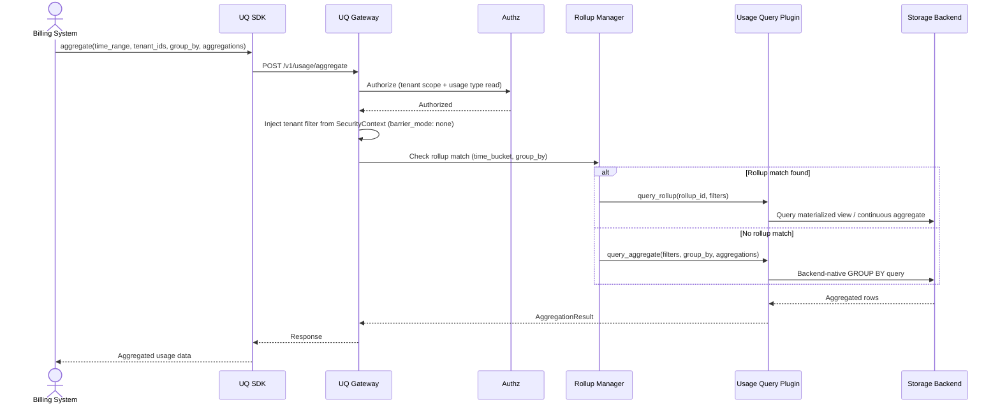
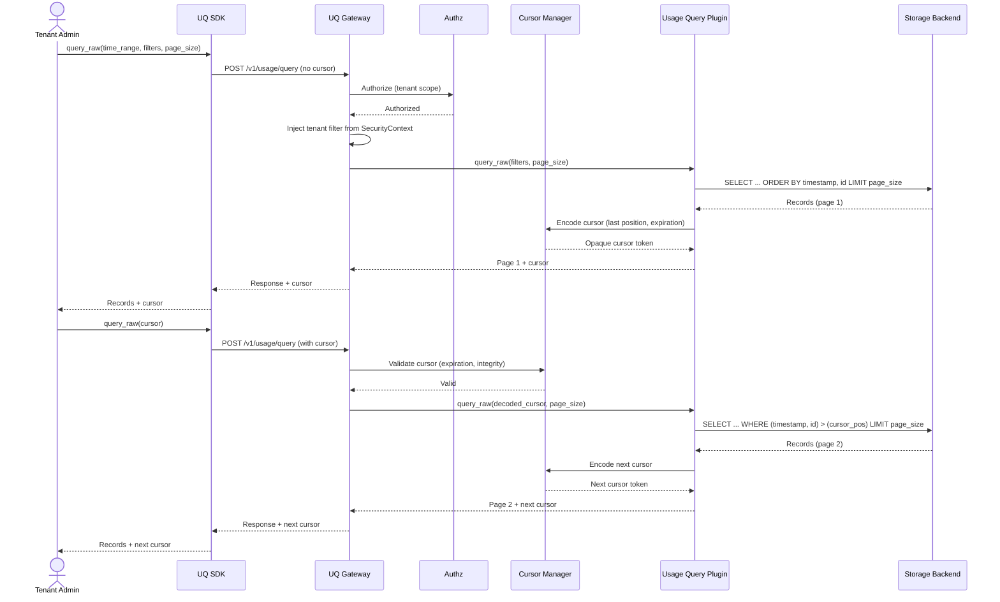
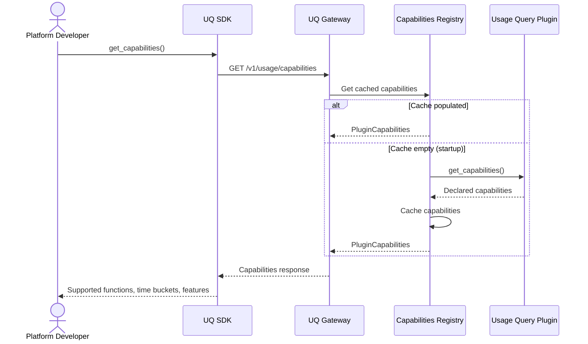

# Technical Design — Usage Query

## 1. Architecture Overview

### 1.1 Architectural Vision

The Usage Query module follows a **plugin-based gateway pattern** aligned with CyberFabric's modkit architecture. The gateway module orchestrates the read path — querying, filtering, aggregation, and rollup management — while delegating data access to pluggable backend plugins (ClickHouse, TimescaleDB, custom). Each plugin implements the full read-path interface for its backend: raw record retrieval with cursor-based pagination, server-side aggregation using backend-native capabilities, and optionally pre-computed rollup management.

The architecture strictly complements the usage-collector module: UC owns the write path (ingestion, validation, deduplication, persistence); Usage Query owns the read path (querying, aggregation, rollups). Both modules share the same storage backends but use separate plugin interfaces optimized for their respective workloads — write-optimized for UC, read-and-aggregation-optimized for UQ. Business logic (pricing, rating, billing rules, invoice generation, quota enforcement) remains the responsibility of downstream consumers.

Server-side aggregation is a first-class concern. At sustained ingestion rates of 10,000+ events/sec, exposing only raw records via paginated API forces consumers to make thousands of calls and re-aggregate data externally. Usage Query solves the data gravity problem by aggregating where data is stored, leveraging each backend's native aggregation capabilities (ClickHouse columnar GROUP BY, TimescaleDB continuous aggregates) to return results in a single call.

### 1.2 Architecture Drivers

#### Functional Drivers

| Requirement | Design Response |
|-------------|-----------------|
| `cpt-cf-usage-query-fr-query-api` | Gateway exposes raw record query API with filtering and cursor-based pagination; delegates to active plugin |
| `cpt-cf-usage-query-fr-stable-ordering` | Plugin contract requires deterministic ordering (timestamp + tiebreaker); cursor encoding preserves position |
| `cpt-cf-usage-query-fr-cursor-pagination` | Cursor Manager encodes opaque cursor tokens with position, validity metadata; 24-hour minimum TTL |
| `cpt-cf-usage-query-fr-snapshot-reads` | Plugin contract includes optional snapshot isolation; Capabilities Registry advertises availability |
| `cpt-cf-usage-query-fr-aggregation-api` | Server-side aggregation delegated to plugin using backend-native capabilities; supports SUM, COUNT, MIN, MAX, AVG, GROUP BY, time bucketing; gateway always evaluates with `barrier_mode: "none"` — usage data is barrier-exempt per platform tenant model |
| `cpt-cf-usage-query-fr-plugin-framework` | Plugin trait defines full read-path contract; gateway discovers active plugin via GTS through Types Registry |
| `cpt-cf-usage-query-fr-plugin-capabilities` | Capabilities Registry exposes plugin-declared features via API; consumers query before submitting requests |
| `cpt-cf-usage-query-fr-rollups` | Rollup Manager routes matching queries to pre-computed rollups; falls back to ad-hoc aggregation for non-matching queries |
| `cpt-cf-usage-query-fr-tenant-isolation` | Fail-closed authorization on all query paths; tenant ID from SecurityContext enforced at gateway and plugin layers |

#### NFR Allocation

| NFR ID | NFR Summary | Allocated To | Design Response | Verification Approach |
|--------|-------------|--------------|-----------------|----------------------|
| `cpt-cf-usage-query-nfr-query-latency` | p95 <= 500ms for 30-day raw queries | Plugin + Storage Backend | Plugin uses backend-native indexed queries; time-based partitioning enables partition pruning for range queries | Load tests measuring p95 latency for 30-day range queries |
| `cpt-cf-usage-query-nfr-aggregation-latency` | p95 <= 500ms (rollup), <= 2,000ms (ad-hoc) for 30-day aggregation | Plugin + Rollup Manager | Pre-computed rollups serve common patterns with sub-500ms latency; ad-hoc aggregation uses backend-native GROUP BY with partition pruning | Latency percentile benchmarks with and without rollups |
| `cpt-cf-usage-query-nfr-authentication` | Zero unauthenticated API access | Transport Layer | All transports require authentication (OAuth 2.0, mTLS, or API key) via platform authn module | Security scan; negative auth tests |
| `cpt-cf-usage-query-nfr-authorization` | Zero unauthorized data access | Gateway + Plugin | Authorization enforced per request via platform authz module; tenant filter injected at gateway; fail-closed on failures | Authorization matrix tests |

### 1.3 Architecture Layers

```text
┌────────────────────────────────────────────────────────────────────┐
│                      Transport Layer                               │
│   Rust API (in-process) │ gRPC │ HTTP/REST                         │
└────────────────────────┬───────────────────────────────────────────┘
                         │
┌────────────────────────▼───────────────────────────────────────────┐
│                     Application Layer                              │
│  UQ Gateway │ Cursor Manager │ Rollup Manager │ Capabilities API   │
└────────────────────────┬───────────────────────────────────────────┘
                         │
┌────────────────────────▼───────────────────────────────────────────┐
│                       Domain Layer                                 │
│  AggregationQuery │ CursorToken │ PluginCapabilities │ RollupConfig│
└────────────────────────┬───────────────────────────────────────────┘
                         │
┌────────────────────────▼───────────────────────────────────────────┐
│                    Infrastructure Layer                            │
│  Usage Query Plugins (ClickHouse, TimescaleDB, custom)             │
│  Types Registry Client │ Authn Client │ Authz Client               │
└────────────────────────────────────────────────────────────────────┘
```

| Layer | Responsibility | Technology |
|-------|---------------|------------|
| Transport | Multi-protocol query endpoints; request deserialization; authentication middleware | gRPC, HTTP/REST, Rust API (in-process) |
| Application | Query orchestration; cursor lifecycle management; rollup routing; capabilities exposure; authorization enforcement | Rust services (modkit module) |
| Domain | Query parameter models; aggregation result types; cursor token encoding; plugin capability declarations; rollup configuration | Rust domain types |
| Infrastructure | Backend-specific query execution; aggregation; rollup management; plugin discovery via Types Registry | Usage Query plugins, Types Registry client, platform auth clients |

## 2. Principles & Constraints

### 2.1 Design Principles

#### Read-Path Ownership

- [ ] `p1` - **ID**: `cpt-cf-usage-query-principle-read-path`

UQ owns the read path: querying, aggregation, cursor-based pagination, rollup management, and capabilities discovery. The write path (ingestion, validation, deduplication, persistence, backfill, retention) belongs to the usage-collector module (`cpt-cf-usage-collector-principle-write-path`). This separation allows each module to optimize independently — UQ for query flexibility, aggregation performance, and read latency; UC for write throughput and ingestion latency.

#### Plugin-Based Storage

- [ ] `p1` - **ID**: `cpt-cf-usage-query-principle-pluggable-storage`

Storage backends are interchangeable plugins implementing a defined read-path trait. The gateway delegates all query and aggregation operations to the active plugin discovered via scoped ClientHub and GTS, following CyberFabric's gateway + plugins pattern. No storage-specific logic exists in the gateway core. New backends can be added by implementing the plugin trait without modifying the gateway.

#### Aggregate Where Stored

- [ ] `p1` - **ID**: `cpt-cf-usage-query-principle-aggregate-where-stored`

Server-side aggregation leverages each backend's native aggregation capabilities rather than transferring raw records for external aggregation. At 10,000+ events/sec sustained ingestion, data gravity makes external aggregation impractical — network transfer, consumer complexity, and end-to-end latency increase by orders of magnitude. The aggregation API is the primary consumer interface; the raw record API is reserved for auditing, debugging, and dispute resolution.

#### Fail-Closed Security

- [ ] `p1` - **ID**: `cpt-cf-usage-query-principle-fail-closed`

Authorization failures always result in query rejection. Tenant isolation is enforced at the gateway layer (tenant filter injection) and the plugin layer (query-level enforcement). When the authorization system is unavailable, queries are rejected rather than allowed. This principle ensures that security failures never result in cross-tenant data exposure (`cpt-cf-usage-query-fr-tenant-isolation`).

### 2.2 Constraints

#### ModKit Module Pattern

- [ ] `p1` - **ID**: `cpt-cf-usage-query-constraint-modkit`

UQ follows CyberFabric's modkit module structure: gateway + plugin pattern with SDK crate, scoped ClientHub for plugin discovery via GTS, SecureConn for database access, and SecurityContext propagation on all operations. The module directory structure follows the canonical layout defined in the NEW_MODULE guideline.

#### SecurityContext Propagation

- [ ] `p1` - **ID**: `cpt-cf-usage-query-constraint-security-context`

All query operations — raw record queries, aggregation queries, capabilities discovery — carry SecurityContext for tenant isolation and authorization. Tenant ID is derived server-side from SecurityContext and is never accepted from request payloads for authorization purposes. Multi-tenant queries (e.g., platform-level billing rollups, monitoring) require PDP authorization. All usage queries are evaluated with `barrier_mode: "none"` — barriers are not enforced for usage data per the platform tenant model.

#### Types Registry Dependency

- [ ] `p1` - **ID**: `cpt-cf-usage-query-constraint-types-registry`

Plugin discovery is delegated to the Types Registry module via GTS schemas. UQ does not own type definitions — usage type validation and schema definitions are managed by the Types Registry, consistent with the usage-collector module's approach (`cpt-cf-usage-collector-constraint-types-registry`).

#### No Business Logic

- [ ] `p1` - **ID**: `cpt-cf-usage-query-constraint-no-business-logic`

UQ provides data aggregation primitives (SUM, COUNT, MIN, MAX, AVG, GROUP BY, time bucketing) but does not interpret, price, or act on the data. No pricing, rating, billing rules, invoice generation, quota policy decisions, or chargeback allocation exists in UQ. Downstream consumers are responsible for all business logic applied to query results.

## 3. Technical Architecture

### 3.1 Domain Model

**Technology**: Rust structs

**Location**: [usage-query-sdk/src/models.rs](../usage-query-sdk/src/models.rs)

**Core Entities**:

| Entity | Description | Schema |
|--------|-------------|--------|
| AggregationQuery | Query parameters for server-side aggregation: time range, filters (tenant, subject, resource, usage type, source), group_by dimensions, aggregation functions, time bucket | [models.rs](../usage-query-sdk/src/models.rs) |
| AggregationResult | Response from an aggregation query: grouped rows with dimension values and computed aggregates | [models.rs](../usage-query-sdk/src/models.rs) |
| RawRecordQuery | Query parameters for raw record retrieval: time range, filters, cursor, page size | [models.rs](../usage-query-sdk/src/models.rs) |
| CursorToken | Opaque pagination state: encoded position in the result set, snapshot timestamp (if applicable), validity metadata, expiration | Domain-internal |
| RollupConfig | Rollup definition: time granularity, grouping dimensions, aggregation functions, backend-specific materialization configuration | [models.rs](../usage-query-sdk/src/models.rs) |
| PluginCapabilities | Declared capabilities: supported aggregation functions, time bucket granularities, feature flags (rollup support, snapshot reads, percentiles, histograms) | [models.rs](../usage-query-sdk/src/models.rs) |

**Relationships**:
- AggregationQuery → RollupConfig: Query may match a rollup configuration (transparent routing by Rollup Manager)
- AggregationResult → AggregationQuery: Result is produced by executing a specific aggregation query
- RawRecordQuery → CursorToken: Paginated queries carry a cursor for position tracking
- RollupConfig → PluginCapabilities: Rollup availability is advertised through capabilities
- CursorToken → snapshot timestamp: Snapshot reads bind the cursor to a point-in-time view

**Invariants**:
- CursorToken validity: cursors remain valid for at least 24 hours after issuance; expired cursors return a retriable error prompting the client to restart the query
- AggregationQuery must specify at least one aggregation function and a time range
- Tenant filter is always injected by the gateway from SecurityContext — never accepted from the client payload for authorization
- All usage queries use `barrier_mode: "none"` — usage data is barrier-exempt per the platform tenant model; this is a module-level invariant, not a client-controlled parameter
- RollupConfig time granularity must be a valid, plugin-supported time bucket
- Multi-value filters (tenant_ids, usage_types, subject_ids, resource_types, source_ids) accept arrays; empty array means no filter on that dimension

### 3.2 Component Model

```text
┌──────────────────────────────────────────────────────────────────────────┐
│                          Usage Query Module                              │
│                                                                          │
│  ┌──────────────────┐    ┌─────────────────────────────────────────┐     │
│  │   SDK Client     │───▶│         UQ Gateway (modkit module)      │     │
│  │  (client-side)   │    │                                         │     │
│  │  - Query builder │    │  ┌──────────┐  ┌───────────┐            │     │
│  │  - Pagination    │    │  │  Cursor  │  │  Rollup   │            │     │
│  │  - Capabilities  │    │  │  Manager │  │  Manager  │            │     │
│  └──────────────────┘    │  └──────────┘  └─────┬─────┘            │     │
│                          │                      │                  │     │
│                          │  ┌───────────────────┴────────────┐     │     │
│                          │  │    Capabilities Registry       │     │     │
│                          │  └────────────────────────────────┘     │     │
│                          └──────────────────────┬──────────────────┘     │
│                                                 │ hub.get_scoped::<dyn   │
│                                                 │   UsageQueryPlugin>    │
│                             ┌───────────────────┼───────────────────┐    │
│                             ▼                   ▼                   ▼    │
│                      ┌──────────────┐   ┌──────────────┐   ┌──────────┐  │
│                      │  ClickHouse  │   │ TimescaleDB  │   │  Custom  │  │
│                      │   Plugin     │   │   Plugin     │   │  Plugin  │  │
│                      └──────────────┘   └──────────────┘   └──────────┘  │
└──────────────────────────────────────────────────────────────────────────┘
                              │                   │                   │
                              ▼                   ▼                   ▼
                     ┌──────────────┐   ┌──────────────┐   ┌──────────────┐
                     │  ClickHouse  │   │ TimescaleDB  │   │   Custom     │
                     │   Database   │   │   Database   │   │   Backend    │
                     └──────────────┘   └──────────────┘   └──────────────┘
```

#### UQ Gateway

**ID**: `cpt-cf-usage-query-component-gateway`

Module entry point following the CyberFabric gateway pattern. Exposes the public API (REST, gRPC, Rust SDK) and routes all read-path operations to the active storage plugin discovered via scoped ClientHub and GTS. Owns query orchestration: authorization enforcement (tenant filter injection from SecurityContext), query validation, cursor lifecycle delegation, rollup routing, and capabilities exposure. All query operations pass through the gateway, which enforces tenant isolation before delegating to the plugin (`cpt-cf-usage-query-fr-tenant-isolation`). All PDP requests use `barrier_mode: "none"` — usage data is barrier-exempt per the platform tenant model.

#### Cursor Manager

**ID**: `cpt-cf-usage-query-component-cursor-manager`

Manages cursor token lifecycle for cursor-based pagination (`cpt-cf-usage-query-fr-cursor-pagination`). Encodes opaque cursor tokens containing: position in the result set (backend-specific offset or key), snapshot timestamp (when snapshot isolation is active), query fingerprint (to detect parameter changes between pages), and expiration timestamp (minimum 24-hour validity). Decodes and validates cursors on subsequent pagination requests. Returns retriable errors for expired or invalid cursors, prompting clients to restart the query. Cursor state is stateless from the gateway perspective — all state is encoded in the token itself and validated by the plugin.

#### Rollup Manager

**ID**: `cpt-cf-usage-query-component-rollup-manager`

Routes aggregation queries to pre-computed rollups when available (`cpt-cf-usage-query-fr-rollups`). Maintains a registry of active rollup configurations. When an aggregation query matches a rollup's time granularity and grouping dimensions, the Rollup Manager transparently redirects the query to the rollup data source. Non-matching queries fall back to ad-hoc aggregation over raw records. Rollup configuration is managed by platform operators without code changes. Rollup creation, refresh, and health monitoring are delegated to the active plugin using backend-native mechanisms (ClickHouse materialized views, TimescaleDB continuous aggregates).

#### Capabilities Registry

**ID**: `cpt-cf-usage-query-component-capabilities-registry`

Exposes the capabilities of the active plugin via API (`cpt-cf-usage-query-fr-plugin-capabilities`). Queries the plugin at startup and caches declared capabilities: supported aggregation functions (SUM, COUNT, MIN, MAX, AVG, and optionally PERCENTILE, HISTOGRAM), supported time bucket granularities, feature flags (rollup support, snapshot read support), and any backend-specific extensions. Consumers query the Capabilities Registry before submitting requests to avoid runtime errors from unsupported operations.

#### Usage Query Plugin Interface

**ID**: `cpt-cf-usage-query-component-plugin-interface`

Rust trait defining the read-path contract that all storage backend plugins implement (`cpt-cf-usage-query-fr-plugin-framework`). Each plugin encapsulates all backend-specific read logic: query syntax differences, cursor implementation (keyset pagination for ClickHouse, cursor-based for PostgreSQL/TimescaleDB), aggregation capabilities, rollup mechanisms, and snapshot isolation support. Follows CyberFabric's plugin pattern with GTS-based discovery via Types Registry.

#### SDK Client

**ID**: `cpt-cf-usage-query-component-sdk`

Client-side library providing the primary query interface for platform services (`cpt-cf-usage-query-interface-sdk`). Implements typed query builders for raw record queries and aggregation queries. Handles cursor-based pagination with iterator abstractions. Provides capabilities discovery methods. Offers both Rust API (in-process) and gRPC transports. The SDK is the primary integration point for other platform modules (billing, monitoring, quota enforcement).

### 3.3 API Contracts

**Technology**: REST/OpenAPI, gRPC, Rust API (in-process)

**Public interface**:

**ID**: `cpt-cf-usage-query-interface-gateway-api`

**Location**: [api/openapi.yaml](../api/openapi.yaml) (REST); [proto/usage_query.proto](../proto/usage_query.proto) (gRPC)

**Endpoints Overview**:

| Method | Path | Description | Stability |
|--------|------|-------------|-----------|
| `POST` | `/v1/usage/query` | Query raw usage records with filters and cursor-based pagination | stable |
| `POST` | `/v1/usage/aggregate` | Execute server-side aggregation query | stable |
| `GET` | `/v1/usage/capabilities` | Discover active plugin capabilities | stable |
| `GET` | `/v1/admin/rollups` | List rollup configurations | stable |
| `PUT` | `/v1/admin/rollups` | Create or update rollup configuration | stable |
| `DELETE` | `/v1/admin/rollups/{id}` | Remove rollup configuration | stable |

All endpoints require authentication (`cpt-cf-usage-query-nfr-authentication`) and enforce authorization (`cpt-cf-usage-query-nfr-authorization`).

#### Error Handling

All API transports use a consistent error envelope:

| HTTP Status | gRPC Code | Error Category | Description |
|-------------|-----------|----------------|-------------|
| 400 | INVALID_ARGUMENT | Validation error | Invalid query parameters, unsupported aggregation function, invalid time range, malformed cursor |
| 403 | PERMISSION_DENIED | Authorization failure | Caller not permitted to query this tenant's data or usage type |
| 404 | NOT_FOUND | Rollup not found | Rollup configuration ID does not exist |
| 410 | FAILED_PRECONDITION | Cursor expired | Cursor token has expired; client should restart the query |
| 422 | UNIMPLEMENTED | Capability not supported | Requested aggregation function or feature not supported by active plugin |
| 503 | UNAVAILABLE | Storage unavailable | Storage backend unreachable; retriable with backoff |

Error responses include: error code (machine-readable string), message (human-readable), and details (structured context: unsupported capability name for 422, cursor restart hint for 410).

**Plugin interface**:

**ID**: `cpt-cf-usage-query-interface-plugin-api`

Rust trait implemented by each storage backend plugin:

| Operation | Description |
|-----------|-------------|
| `query_raw` | Retrieve raw usage records matching filters with cursor-based pagination and stable ordering |
| `query_aggregate` | Execute server-side aggregation using backend-native capabilities |
| `query_rollup` | Query pre-computed rollup data for matching aggregation requests |
| `create_rollup` | Create a pre-computed rollup using backend-native mechanisms |
| `drop_rollup` | Remove a pre-computed rollup |
| `list_rollups` | List active rollup configurations with health status |
| `get_capabilities` | Declare supported aggregation functions, time buckets, and features |
| `health_check` | Report storage backend health status for query operations |

### 3.4 Internal Dependencies

| Dependency Module | Interface Used | Purpose |
|-------------------|----------------|---------|
| usage-collector | Shared storage backend (read from tables owned by UC write-path plugins) | Usage records are ingested and persisted by UC; UQ reads from the same storage |
| types-registry | SDK client (`TypesRegistryClient` via ClientHub) | GTS-based plugin discovery; usage type metadata for query validation |
| authn | Platform authentication middleware | Identity verification; SecurityContext provisioning for all API requests |
| authz | SDK client (`AuthzClient` via ClientHub) | Per-request authorization; tenant isolation enforcement; usage type read permissions |

**Dependency Rules** (per project conventions):
- No circular dependencies
- Always use SDK modules for inter-module communication
- No cross-category sideways deps except through contracts
- Only integration/adapter modules talk to external systems
- `SecurityContext` must be propagated across all in-process calls

### 3.5 External Dependencies

#### ClickHouse

**Type**: Database (shared with usage-collector)
**Direction**: inbound (read-only via ClickHouse query plugin)
**Protocol / Driver**: ClickHouse native protocol or HTTP interface via Rust client library
**Data Format**: Columnar storage; aggregation queries leverage native GROUP BY and materialized views
**Compatibility**: Schema owned by usage-collector ClickHouse plugin; UQ plugin reads from existing tables and creates materialized views for rollups

#### TimescaleDB

**Type**: Database (shared with usage-collector)
**Direction**: inbound (read-only via TimescaleDB query plugin)
**Protocol / Driver**: PostgreSQL protocol via SeaORM/SecureConn
**Data Format**: Hypertable-based time-series storage with automatic partitioning; continuous aggregates for rollups
**Compatibility**: Schema owned by usage-collector TimescaleDB plugin; UQ plugin reads from existing hypertables and creates continuous aggregates for rollups

### 3.6 Interactions & Sequences

#### Aggregation Query

**ID**: `cpt-cf-usage-query-seq-aggregation-query`

**Use cases**: `cpt-cf-usage-query-usecase-billing-query`

**Actors**: `cpt-cf-usage-query-actor-billing-system`, `cpt-cf-usage-query-actor-monitoring-system`



**Description**: Primary aggregation flow for high-volume consumers. The gateway authorizes the request, injects the tenant filter with `barrier_mode: "none"` (usage data is barrier-exempt), and checks for matching rollups. If a rollup matches the query's time bucket and grouping dimensions, the query is served from pre-computed data. Otherwise, the plugin executes backend-native aggregation over raw records. Aggregation is always performed server-side, avoiding the need to transfer millions of raw records.

#### Raw Record Query with Cursor Pagination

**ID**: `cpt-cf-usage-query-seq-raw-query-pagination`

**Use cases**: `cpt-cf-usage-query-usecase-raw-billing-query`, `cpt-cf-usage-query-usecase-tenant-usage-query`

**Actors**: `cpt-cf-usage-query-actor-billing-system`, `cpt-cf-usage-query-actor-tenant-admin`



**Description**: Raw record retrieval with cursor-based pagination. The first request executes without a cursor; the plugin returns the first page with an opaque cursor token encoding the position after the last record. Subsequent requests pass the cursor to retrieve the next page. Stable ordering (timestamp + deterministic tiebreaker) ensures no records are missed or duplicated across pages (`cpt-cf-usage-query-fr-stable-ordering`). Cursors remain valid for at least 24 hours (`cpt-cf-usage-query-fr-cursor-pagination`).

#### Capabilities Discovery

**ID**: `cpt-cf-usage-query-seq-capabilities-discovery`

**Use cases**: (implied by `cpt-cf-usage-query-fr-plugin-capabilities`)

**Actors**: `cpt-cf-usage-query-actor-platform-developer`, `cpt-cf-usage-query-actor-billing-system`



**Description**: Consumers query the Capabilities Registry before submitting aggregation requests. The registry caches the active plugin's declared capabilities at startup and serves them from cache. This allows consumers to discover at runtime which aggregation functions, time bucket granularities, and features (rollups, snapshot reads, percentiles) are available, preventing runtime errors from unsupported requests.

### 3.7 Database Schemas & Tables

Usage Query does not own the primary `usage_records` table — that table is owned by the usage-collector module (`cpt-cf-usage-collector-dbtable-usage-records`). UQ plugins read from this table and create additional read-optimized structures.

**Rollup tables**: Backend-specific, created and managed by UQ plugins.

#### Rollup: ClickHouse Materialized Views

**ID**: `cpt-cf-usage-query-dbtable-rollup-clickhouse`

ClickHouse plugin creates materialized views for each rollup configuration. Materialized views are incrementally updated on insert by ClickHouse engine. Example logical structure for an hourly rollup:

| Column | Type | Description |
|--------|------|-------------|
| tenant_id | UUID | Tenant identifier |
| usage_type | VARCHAR | Usage type |
| subject_id | VARCHAR | Subject identifier (when grouped) |
| resource_type | VARCHAR | Resource type (when grouped) |
| time_bucket | TIMESTAMP | Start of the time bucket (hourly) |
| sum_value | DOUBLE | SUM(value) for the bucket |
| count_value | BIGINT | COUNT(value) for the bucket |
| min_value | DOUBLE | MIN(value) for the bucket |
| max_value | DOUBLE | MAX(value) for the bucket |

**Additional info**: Materialized views are partitioned by `time_bucket`. View definitions are generated by the plugin based on rollup configuration. Multiple rollup granularities (hourly, daily) create separate materialized views.

#### Rollup: TimescaleDB Continuous Aggregates

**ID**: `cpt-cf-usage-query-dbtable-rollup-timescaledb`

TimescaleDB plugin creates continuous aggregates for each rollup configuration. Continuous aggregates are automatically refreshed by TimescaleDB. Logical structure matches the ClickHouse rollup above.

**Additional info**: Continuous aggregates leverage TimescaleDB's native refresh policies for automatic, incremental maintenance. Refresh lag is configurable per rollup.

#### Table: rollup_configs

**ID**: `cpt-cf-usage-query-dbtable-rollup-configs`

| Column | Type | Description |
|--------|------|-------------|
| id | UUID | Primary key |
| name | VARCHAR | Human-readable rollup name |
| time_granularity | VARCHAR | Time bucket size (e.g., '1 hour', '1 day') |
| group_by_dimensions | JSONB | List of dimensions to group by |
| aggregation_functions | JSONB | List of aggregation functions to compute |
| backend_ref | VARCHAR | Backend-specific reference (materialized view name, continuous aggregate name) |
| status | ENUM | 'active', 'creating', 'failed', 'dropping' |
| created_at | TIMESTAMP | Creation timestamp |
| updated_at | TIMESTAMP | Last update timestamp |

**PK**: `id`

**Constraints**: `name` UNIQUE, `time_granularity` NOT NULL, `status` NOT NULL DEFAULT 'creating'

**Additional info**: Stored in the same backend as usage records. The `backend_ref` links to the plugin-specific materialized artifact. Status tracks the lifecycle of rollup creation (async for large datasets).

## 4. Additional Context

### Non-Applicable Sections

**Deployment Architecture**: Not applicable because UQ is deployed as part of the CyberFabric modular monolith; deployment topology, container strategy, and orchestration are defined at the platform level, not per-module. See platform-level deployment documentation.

**Privacy Architecture**: Not applicable because usage records do not contain PII. Tenant isolation (`cpt-cf-usage-query-fr-tenant-isolation`) is the privacy boundary — all data access is scoped to the authenticated tenant. If PII requirements emerge, they will be addressed at the platform level.

**Frontend / User-Facing Architecture**: Not applicable because UQ is a backend service/library with no user-facing UI. Consumers interact via SDK, gRPC, or HTTP API.

**Compliance Architecture**: Not applicable because UQ does not handle regulated data beyond tenant isolation. Compliance requirements (SOC 2, GDPR) are addressed at the platform level.

### Performance Architecture

**Caching strategy**: Plugin capabilities are cached at startup. Rollup configuration is cached in the Rollup Manager and refreshed on configuration changes. Query results are not cached — backend query engines handle their own caching (ClickHouse page cache, TimescaleDB shared buffers).

**Database access patterns**: All queries use time-range filtering, which enables partition pruning on time-partitioned tables. Aggregation queries leverage backend-native GROUP BY operations rather than application-side aggregation. Rollup queries read from pre-computed aggregates, avoiding raw record scans.

**Scalability**: UQ is stateless (cursor state is encoded in tokens). Horizontal scaling is achieved by running additional gateway instances. Plugin connections to storage backends use connection pooling.

### Open Questions from PRD

The following PRD open questions (`§ 13. Open Questions`) affect design decisions that are deferred to ADRs:

- **Federated-query merge strategy**: How to guarantee stable ordering when merging results from operational and historical storage tiers. Design impact: cursor encoding and plugin trait may need multi-source awareness. Deferred to ADR.
- **Cursor semantics for federated queries**: Cursor token payload format for pagination across storage tiers. Design impact: CursorToken model may need source shard identifiers. Deferred to ADR.
- **Migration coordination for federated cursors**: How cursors spanning an operational-to-historical migration are handled. Deferred to ADR.
- **Rollup granularity defaults**: Initial implementation supports operator-configured granularities; defaults to be determined by operational experience.
- **Aggregation query result size limits**: Whether aggregation responses need pagination. Initial implementation returns all groups; size limits to be added if operational experience demonstrates the need.

## 5. Traceability

- **PRD**: [PRD.md](./PRD.md)
- **ADRs**: [ADR/](./ADR/)
- **Features**: [features/](./features/)
